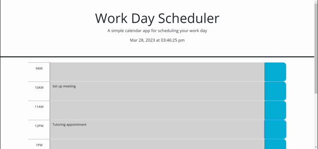

# Work Day Scheduler
## Having trouble keeping track of your busy work schedule? Stay on track with this Work Day Scheduler! Easily log and save things that you need to get done and rest assured that they'll be here the next time you come back!

# Description
## This website is a Work Day Scheduler. You can write and save your notes in their respective time slots as well as refer to the current time and date.

# Usage
## Upon opening the page, you'll be presented with the current date and time. Along with this, the time that has already passed will be grayed out, the current time will be highlighed in red, and the times in the future will be highlighted green. Write your notes in their respective time slots and press the button to the side in order to save the notes. These notes will be saved to the browswer, even upon refreshing.

# GIF of application

# Links
- [GitHub-Repo](https://github.com/alexiskeet/Work-Day-Scheduler.git)
- [Live-Site](https://alexiskeet.github.io/Work-Day-Scheduler/)

